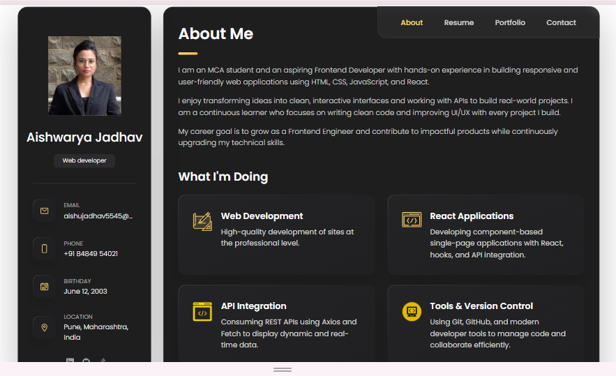
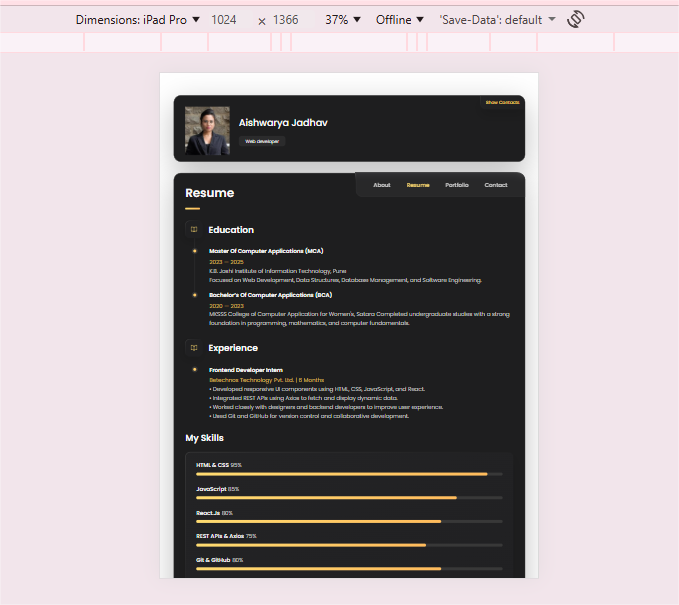
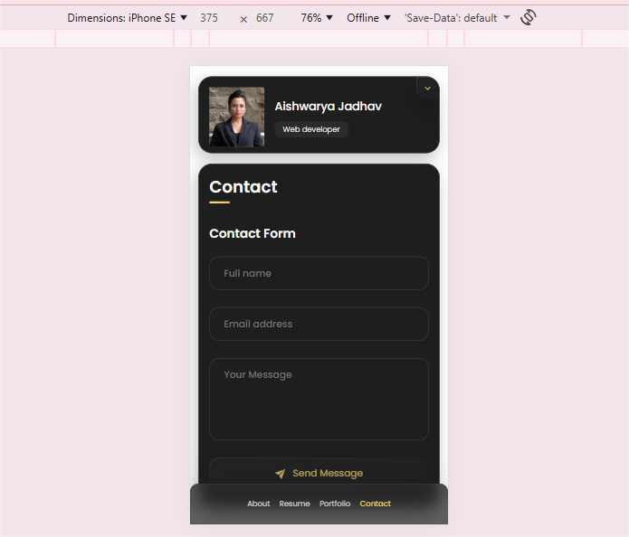

# Aishu - Personal portfolio

It is a fully responsive personal portfolio website, responsive for all devices, built using HTML, CSS, and JavaScript.

## Demo





## Prerequisites

Before you begin, ensure you have met the following requirements:

* [Git](https://git-scm.com/downloads "Download Git") must be installed on your operating system.

## Installing Portfolio

To install **Portfolio**, follow these steps:

Linux and macOS:

```bash
sudo git clone https://github.com/Aishu1206-github/aishwarya_portfolio.git
```

Windows:

```bash
git clone https://github.com/Aishu1206-github/aishwarya_portfolio.git
```

## Contact

If you want to contact me you can reach me at [LinkedIn](https://www.linkedin.com/in/aishwarya-jadhav-7582ab226/).


